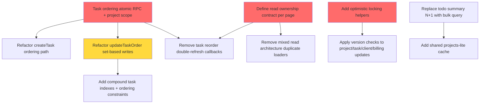

# Technical Debt Audit Summary

Generated: 2026-02-15
Based on: 6 available audit phases (Phase 1 report `phase1-data-flow-audit.md` was not present in repository root)

---

## Executive Summary

- **Total P0 issues:** 8
- **Total P1 issues:** 8
- **Total P2 issues:** 4
- **Estimated total effort:** 9-13 weeks
- **Critical path duration:** 4-5 weeks

---

## P0 Issues (Critical - Must Fix)

### P0-1: Task ordering corruption (cross-project scope + non-atomic reorder/create)

**Source:** Phase 2, Sections 2.2 + 2.5; Phase 3, Sections 3.1 + 3.4; Phase 6, Section 6.1
**Files Affected:**

- `app/actions/tasks.ts:21-46`
- `app/actions/tasks.ts:130-240`
- `supabase/migrations/001_initial_schema.sql:21,29`

**Impact:**

- Duplicate/gapped `order_index`, cross-project order pollution, and non-deterministic board ordering under concurrent operations.

**Root Cause:**

- Read-then-write `max(order_index)+1` and per-row reorder loops are scoped by `status` but not consistently by `project_id`, with no transactional guardrails.

**Estimated Effort:** 5-7 days

**Blocks:** P0-2, P0-6, P1-1, P1-2

---

### P0-2: `createTask` race condition on max-order assignment

**Source:** Phase 2, Section 2.1.1/2.5 (Issue 2.1-A); Phase 3, Section 3.1
**Files Affected:**

- `app/actions/tasks.ts:21-44`

**Impact:**

- Concurrent creates can assign identical `order_index`, breaking stable kanban ordering.

**Root Cause:**

- Two concurrent requests read the same max index before either insert commits.

**Estimated Effort:** 2-3 days

**Blocks:** P1-1

---

### P0-3: `updateTaskOrder` race + partial-loop failure

**Source:** Phase 2, Section 2.1.1/2.5 (Issue 2.1-B); Phase 3, Section 3.1
**Files Affected:**

- `app/actions/tasks.ts:154-232`

**Impact:**

- Interleaved reorders and mid-loop failures leave inconsistent indexes and flickering client state.

**Root Cause:**

- Multi-step read + iterative update loops without transaction boundaries or consistent lock order.

**Estimated Effort:** 2-3 days

**Blocks:** P1-2, P1-3

---

### P0-4: Split cross-table write in `updateBusinessFieldsAction`

**Source:** Phase 2, Section 2.1.4/2.5 (Issue 2.1-C); Phase 3, Section 3.1
**Files Affected:**

- `app/clients/actions.ts:332-374`

**Impact:**

- Businesses and related projects can diverge on `client_id`, causing inconsistent reporting and UI relationships.

**Root Cause:**

- Two-step update (`businesses` then `projects`) runs without transaction and without proper second-step error handling.

**Estimated Effort:** 2-3 days

**Blocks:** P1-4

---

### P0-5: Mixed read ownership architecture

**Source:** Phase 2, Section 2.4 + 2.5 (Issue 2.4-A)
**Files Affected:**

- `components/ProjectKanbanClient.tsx:110-125`
- `components/AnalyticsDashboard.tsx:44-56`
- `app/billings/BillingsPageClient.tsx:54-75`

**Impact:**

- Duplicate fetches, stale windows, and inconsistent source-of-truth behavior across pages.

**Root Cause:**

- Server actions trigger `revalidatePath` while clients also force immediate local reloads.

**Estimated Effort:** 4-6 days

**Blocks:** P0-6, P1-5, P1-6

---

### P0-6: Double-refresh pattern after mutations

**Source:** Phase 2, Section 2.4 + 2.5 (Issue 2.4-B)
**Files Affected:**

- `components/KanbanBoard.tsx:156-163`
- `components/EditProjectModal.tsx:107-114`
- `app/billings/BillingsPageClient.tsx:165-177`

**Impact:**

- ~67% request overhead in audited journeys, plus visible stale/flicker windows.

**Root Cause:**

- Both server revalidation and client callbacks reload the same data path for one mutation.

**Estimated Effort:** 3-5 days

**Blocks:** P1-5, P2-3

---

### P0-7: Todo summary N+1 per-project fetch loop

**Source:** Phase 6, Section 6.1 (Pattern #1)
**Files Affected:**

- `app/todo/actions.ts:303-338`

**Impact:**

- Query count scales with project count (`1 + 1 + N`), causing multi-second slowdowns for heavier accounts.

**Root Cause:**

- Fetching todo items inside a per-project loop instead of one bulk query + grouping.

**Estimated Effort:** 1-2 days

**Blocks:** P1-7

---

### P0-8: No runtime transaction boundary on critical writes

**Source:** Phase 3, Sections 3.1.2 and 3.4
**Files Affected:**

- `app/actions/tasks.ts`
- `app/clients/actions.ts`
- `app/budgets/actions.ts`
- `lib/todo/lists.ts`

**Impact:**

- Critical write paths can partially apply and silently corrupt domain invariants during failures/retries.

**Root Cause:**

- Audited runtime code has 0 explicit transaction wrappers / transactional RPC mutation paths.

**Estimated Effort:** 1-2 weeks

**Blocks:** Most integrity work in P1 phases

---

## P1 Issues (High Priority)

### P1-1: Remaining non-versioned updates (lost-update risks)

**Source:** Phase 2, Section 2.5 (Issue 2.1-E); Phase 3, Section 3.2
**Files Affected:**

- `app/actions/projects.ts:67-108`
- `app/actions/tasks.ts:67-80`
- `app/clients/actions.ts:127-145`
- `app/billings/actions.ts:98-111`

**Impact:**

- Last-write-wins overwrites user changes without conflict detection.

**Root Cause:**

- `updated_at` exists across major tables but is not used in update predicates.

**Estimated Effort:** 4-6 days

**Blocks:** P2-1

---

### P1-2: Billing status flip-flop race

**Source:** Phase 2, Section 2.5 (Issue 2.1-D); Phase 3, Section 3.3
**Files Affected:**

- `app/billings/actions.ts:94-111`

**Impact:**

- `paid_at` can be set then nulled under concurrent status updates.

**Root Cause:**

- No optimistic lock / transition guard on status mutation.

**Estimated Effort:** 0.5-1 day

**Blocks:** None

---

### P1-3: FK semantic orphaning (`SET NULL`) behavior not codified

**Source:** Phase 2, Sections 2.3 + 2.5 (Issue 2.3-A)
**Files Affected:**

- `supabase/migrations/20260213120000_add_billings_module.sql:8-9`
- `supabase/migrations/202601250000_presupuestos.sql:8`
- `supabase/migrations/20260208140000_clients_and_businesses.sql:157-159`

**Impact:**

- Detached records (billings/budgets/projects) remain valid but semantically ambiguous for UX/reporting.

**Root Cause:**

- `ON DELETE SET NULL` is used without explicit product behaviors for detached entities.

**Estimated Effort:** 2-3 days

**Blocks:** None

---

### P1-4: Budget duplication/reorder amplification and partial-write risk

**Source:** Phase 3, Section 3.1; Phase 6, Section 6.1 (Patterns #4/#5)
**Files Affected:**

- `app/budgets/actions.ts:269-352`
- `app/budgets/[id]/actions.ts:214-230`
- `app/budgets/[id]/actions.ts:418-441`

**Impact:**

- Large budget operations create many statements and partial clones under failure.

**Root Cause:**

- Sequential and batched per-row writes instead of transactional set-based SQL.

**Estimated Effort:** 4-6 days

**Blocks:** None

---

### P1-5: `SELECT *` overfetch in hot views

**Source:** Phase 6, Section 6.2
**Files Affected:**

- `components/AnalyticsDashboard.tsx:48-57`
- `components/ProjectKanbanClient.tsx:113-117`
- `app/billings/BillingsPageClient.tsx:54-56`

**Impact:**

- Larger payloads and slower route hydration in dashboard/project shells.

**Root Cause:**

- Broad row hydration where only a subset of columns is used.

**Estimated Effort:** 2-4 days

**Blocks:** None

---

### P1-6: Missing compound indexes for dominant query patterns

**Source:** Phase 5, Section 5.3
**Files Affected:**

- `app/actions/tasks.ts:157-170,198-202`
- `lib/todo/lists.ts:44-56,267-273`
- `app/notes/actions.ts:18-19,137-138`

**Impact:**

- Higher p95 latency as datasets grow; more costly scans on ordered owner/project queries.

**Root Cause:**

- Single-column indexes exist, but filter+sort combinations are not indexed.

**Estimated Effort:** 2-3 days

**Blocks:** P2-4

---

### P1-7: Shared cache gaps for common reference datasets

**Source:** Phase 6, Section 6.3
**Files Affected:**

- `components/DashboardClient.tsx:30-33`
- `app/todo/TodoPageClient.tsx:18-23`
- `app/settings/SettingsLayoutClient.tsx:26-29`

**Impact:**

- Repeated route navigation re-queries same project/client lists.

**Root Cause:**

- No app-wide `projects-lite`/`clients-lite` caching contract.

**Estimated Effort:** 3-4 days

**Blocks:** None

---

### P1-8: Coupling hotspots / god-file debt in client-business domain

**Source:** Phase 7, Sections 7.3 and 7.4
**Files Affected:**

- `app/clients/actions.ts` (~468 LOC, 19 exports)
- `components/Sidebar.tsx` (~439 LOC)

**Impact:**

- Slower safe-change velocity; high regression risk when touching shared behaviors.

**Root Cause:**

- CRUD orchestration, UI composition, and domain command logic are co-located.

**Estimated Effort:** 1-2 weeks

**Blocks:** P2-2

---

## P2 Issues (Quality Improvements)

### P2-1: State transition policy hardening

**Source:** Phase 3, Section 3.3
**Files Affected:**

- `app/actions/tasks.ts:70,232`
- `app/budgets/[id]/actions.ts:328`

**Impact:**

- Enum-valid but business-invalid transitions remain possible.

**Root Cause:**

- No explicit transition matrices/validators in app code.

**Estimated Effort:** 2-3 days

**Blocks:** None

---

### P2-2: UI/business-logic separation in detail/list components

**Source:** Phase 7, Section 7.4
**Files Affected:**

- `app/businesses/[id]/BusinessDetailClient.tsx`
- `app/clients/[id]/ClientDetailClient.tsx`
- `app/budgets/[id]/components/ItemsList.tsx`

**Impact:**

- Lower testability and larger blast radius for UI changes.

**Root Cause:**

- Command logic and rendering logic are tightly coupled.

**Estimated Effort:** 1-2 weeks

**Blocks:** None

---

### P2-3: RLS regression automation + intent documentation

**Source:** Phase 4, Sections 4.2 and 4.5
**Files Affected:**

- `supabase/migrations/20260214000000_profile_and_branding.sql:59-71`
- Security docs for partial CRUD policy rationale

**Impact:**

- Security posture is currently strong but relies on manual review, not executable evidence.

**Root Cause:**

- Missing CI-level RLS tests and missing docs for intentionally partial policy surfaces.

**Estimated Effort:** 2-4 days

**Blocks:** None

---

### P2-4: Drift detection + type-safety cleanup (`as any`/`as never`)

**Source:** Phase 5, Sections 5.1 and 5.4
**Files Affected:**

- `app/actions/projects.ts`
- `app/actions/tasks.ts`
- `app/clients/actions.ts`
- `app/billings/actions.ts`

**Impact:**

- Weakens compile-time protection and can hide schema drift issues.

**Root Cause:**

- Runtime code bypasses generated Supabase type rigor in key paths.

**Estimated Effort:** 3-5 days

**Blocks:** None

---

## Cross-References

Issues that affect multiple domains:

- **Task ordering corruption (P0-1)** impacts concurrency, performance, and data integrity domains simultaneously.
- **Mixed read ownership + double refresh (P0-5/P0-6)** impacts architecture, performance, and UX consistency.
- **Non-versioned writes (P1-1)** impacts concurrency, auditability, and conflict UX.
- **Coupling hotspots (P1-8)** amplify risk in every module touched by the above fixes.

---

## Fix Dependencies & Critical Path

### Dependency Graph

### Critical Path (Must Do First)

These fixes BLOCK other work:

1. **Task ordering atomic RPC + project scoping (P0-1)** - Blocks: createTask race fix, reorder loop removal, task-index hardening, kanban refresh cleanup.
2. **Read ownership contract (P0-5)** - Blocks: systematic double-refresh removal and shared cache adoption across dashboard/project/billings/todo.
3. **Optimistic locking foundation (P1-1 prerequisite infra)** - Blocks: safe rollout of non-versioned update fixes across projects/tasks/clients/billings.

### Parallelizable Work

These can be done independently:

- `updateBusinessFieldsAction` atomicization (P0-4) after transaction pattern is decided.
- Todo summary N+1 elimination (P0-7).
- RLS automation/documentation (P2-3).
- Coupling/god-file decomposition (P1-8/P2-2) once integrity-critical paths are stabilized.
