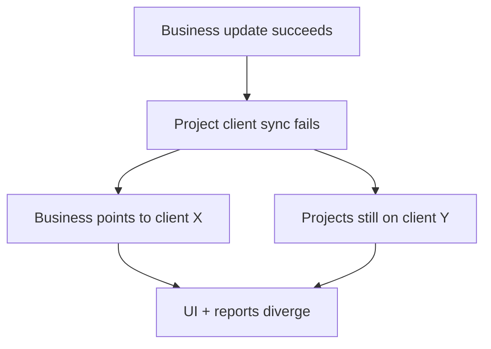
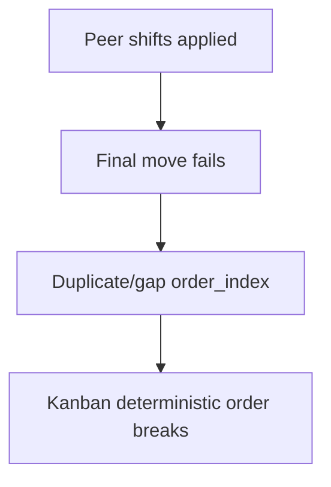
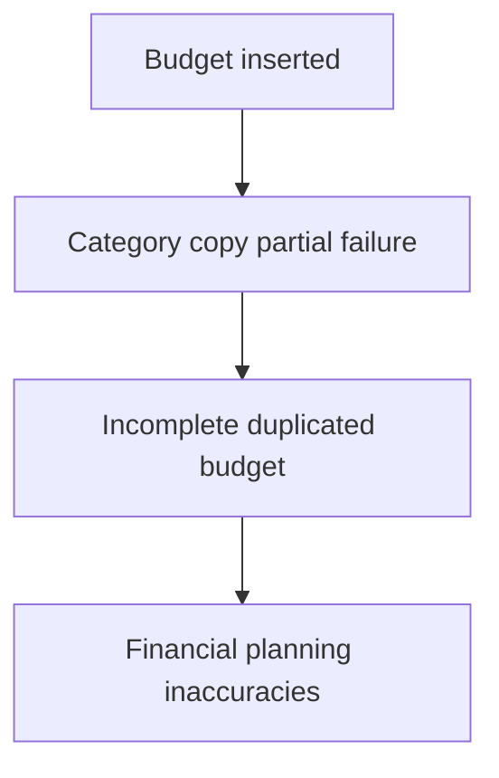

# Phase 3: Concurrency & Race Condition Analysis (Deep Dive)

## 3.1 Transaction Boundary Analysis

## 3.1.1 Multi-step write operations without explicit transaction wrappers

### ⚠️ MULTI-STEP OPERATION: `updateBusinessFieldsAction`
**Location:** `app/clients/actions.ts:332-373`

**Steps:**
```typescript
// Step 1
await supabase.from('businesses').update(payload).eq('id', id).select().single()

// Step 2 (conditional cross-table write)
await supabase.from('projects').update({ client_id: newClientId }).eq('business_id', id)
```

**Failure Scenarios:**
1. Partial success: business row updates, project cascade update fails -> business/client relation diverges from project.client_id set.
2. Concurrent interference: another actor updates project.client_id between steps.
3. Network timeout between step 1 and 2 leaves split state.

**Current Error Handling:** returns early only for step-1 error; step-2 error is not checked.  
**Missing Rollback Logic:** ✅ YES  
**Fix Priority:** P0  
**Estimated Effort:** 1–2 days

**Atomic Alternative (RPC sketch):**
```sql
create or replace function atomic_update_business_and_projects(...)
returns void as $$
begin
  update businesses ...;
  update projects set client_id = ... where business_id = ...;
end;
$$ language plpgsql;
```

---

### ⚠️ MULTI-STEP OPERATION: `updateTaskOrder`
**Location:** `app/actions/tasks.ts:130-240`

**Steps:**
```typescript
// Step 1 read moving task
await supabase.from('tasks').select('order_index, status').eq('id', taskId).single()
// Step 2 read affected column tasks
await supabase.from('tasks').select('id, order_index').eq('status', ...)
// Step 3..N loop updates shifting peers
await supabase.from('tasks').update({ order_index: ... }).eq('id', t.id)
// Final step update moved task
await supabase.from('tasks').update({ status: newStatus, order_index: newOrderIndex }).eq('id', taskId)
```

**Failure Scenarios:**
1. Partial success in middle of loop -> mixed old/new ordering.
2. Concurrent reorder interleaves row updates.
3. Timeout before final moved-task update leaves peer shifts applied but mover unchanged.

**Current Error Handling:** only final update error is checked.  
**Missing Rollback Logic:** ✅ YES  
**Fix Priority:** P0  
**Estimated Effort:** 2–3 days

---

### ⚠️ MULTI-STEP OPERATION: `createTask`
**Location:** `app/actions/tasks.ts:21-46`

**Steps:**
```typescript
// Step 1 read max order
await supabase.from('tasks').select('order_index').eq('status', status).order('order_index', ...).single()
// Step 2 insert with computed order_index
await supabase.from('tasks').insert({ ..., order_index: orderIndex }).select().single()
```

**Failure Scenarios:**
1. Concurrent inserts read same max -> duplicate order.
2. Timeout after read before write -> stale computed index on retry.

**Current Error Handling:** checks insert error only.  
**Missing Rollback Logic:** ✅ YES  
**Fix Priority:** P0  
**Estimated Effort:** 1–2 days

---

### ⚠️ MULTI-STEP OPERATION: `duplicateBudget`
**Location:** `app/budgets/actions.ts:269-352`

**Steps:**
```typescript
await supabase.from('budgets').insert(...).single()           // new budget
for (const category of categoriesData) {
  await supabase.from('budget_categories').insert(...).single() // each category
  await supabase.from('budget_items').insert(itemInserts)       // each item batch
}
```

**Failure Scenarios:**
1. New budget exists but categories/items partially copied.
2. Failure in category #N leaves incomplete duplicate tree.
3. Retry can create multiple partial clones.

**Current Error Handling:** throws on inner failures; no cleanup/rollback of already inserted rows.  
**Missing Rollback Logic:** ✅ YES  
**Fix Priority:** P1  
**Estimated Effort:** 2–4 days

---

### ⚠️ MULTI-STEP OPERATION: `createItem` (budget)
**Location:** `app/budgets/[id]/actions.ts:250-291`

**Steps:**
```typescript
await supabase.from('budget_categories').select('budget_id').eq('id', formData.category_id).single()
await supabase.from('budget_items').select('sort_order').eq('category_id', formData.category_id).order('sort_order', ...).single()
await supabase.from('budget_items').insert({ ..., sort_order: nextOrder }).single()
```

**Failure Scenarios:**
1. Concurrent creates compute same `nextOrder`.
2. Category moved/deleted between validation read and insert.

**Missing Rollback Logic:** ✅ YES  
**Fix Priority:** P1  
**Estimated Effort:** 1–2 days

---

### ⚠️ MULTI-STEP OPERATION: `reorderItems` (budget)
**Location:** `app/budgets/[id]/actions.ts:418-441`

**Steps:**
```typescript
await supabase.from('budget_categories').select('id').eq('id', categoryId).eq('budget_id', budgetId).single()
await Promise.all(itemIds.map((id, index) =>
  supabase.from('budget_items').update({ sort_order: index }).eq('id', id).eq('category_id', categoryId)
))
```

**Failure Scenarios:**
1. Partial update if one Promise fails.
2. Concurrent reorder can interleave and scramble ordering.

**Current Error Handling:** no per-update result validation before success return.  
**Missing Rollback Logic:** ✅ YES  
**Fix Priority:** P1  
**Estimated Effort:** 1–2 days

---

### ⚠️ MULTI-STEP OPERATION: `reorderCategories`
**Location:** `app/budgets/[id]/actions.ts:214-230`

**Steps:**
```typescript
await Promise.all(categoryIds.map((id, index) =>
  supabase.from('budget_categories').update({ sort_order: index }).eq('id', id)
))
```

**Failure Scenarios:** partial order updates; concurrent reorder conflicts.  
**Missing Rollback Logic:** ✅ YES  
**Fix Priority:** P2  
**Estimated Effort:** 0.5–1 day

---

### ⚠️ MULTI-STEP OPERATION: `createTodoItem`
**Location:** `lib/todo/lists.ts:321-357`

**Steps:**
```typescript
await supabase.from('todo_lists').select('id').eq('id', input.list_id).eq('owner_id', ownerId).single()
await supabase.from('todo_items').select('position').eq('list_id', input.list_id).order('position', ...).limit(1)
await supabase.from('todo_items').insert({ ..., position }).single()
```

**Failure Scenarios:** concurrent inserts produce duplicate positions.  
**Missing Rollback Logic:** ✅ YES  
**Fix Priority:** P1  
**Estimated Effort:** 1–2 days

## 3.1.2 Explicit transaction usage audit

### 📊 TRANSACTION USAGE AUDIT
- **Explicit transactions found in app code:** **0** (`BEGIN/COMMIT/ROLLBACK` absent in `app/` and `lib/` runtime code).
- **Supabase `.rpc()` usage wrapping transactions:** **0** in application runtime code.
- `BEGIN` appears only inside SQL migrations/functions (schema setup), not in request-time mutation logic.

**Percentage of critical write operations wrapped (Phase 1/2 audited paths):** **0%**.

**Verdict:** ❌ **CRITICAL GAP: No runtime transactions in audited write paths.**

## 3.1.3 Blast radius of missing transactions

### 💥 BLAST RADIUS: `updateBusinessFieldsAction`
**Affected tables:** `businesses`, `projects`  
**Affected relationships:** `projects.business_id`, `projects.client_id`, `businesses.client_id`



- **Integrity impact:** HIGH
- **Auditability:** low (no state-change journal)
- **Automatic recovery:** none

### 💥 BLAST RADIUS: `updateTaskOrder`
**Affected tables:** `tasks`  
**Affected relationships:** project task board ordering integrity



- **Integrity impact:** HIGH
- **Auditability:** low (no before/after ordering log)
- **Automatic recovery:** none

### 💥 BLAST RADIUS: `duplicateBudget`
**Affected tables:** `budgets`, `budget_categories`, `budget_items`



- **Integrity impact:** MEDIUM-HIGH
- **Recovery:** manual cleanup required

---

## 3.2 Optimistic Locking Assessment

## 3.2.1 Read-then-write patterns without optimistic lock (>=10)

### 🔄 #1 `createTask`
**Location:** `app/actions/tasks.ts:21-44`  
Read max -> write insert with computed index; no version check.

### 🔄 #2 `updateTaskOrder`
**Location:** `app/actions/tasks.ts:140-232`  
Read task + read columns -> many writes; no version lock.

### 🔄 #3 `createBilling`
**Location:** `app/billings/actions.ts:72-91`  
No pre-read of row, but write conflicts with subsequent status updates due no version gate.

### 🔄 #4 `updateBillingStatus`
**Location:** `app/billings/actions.ts:98-111`  
Implicitly depends on current status/paid_at semantics; no expected-version predicate.

### 🔄 #5 `updateBusinessFieldsAction`
**Location:** `app/clients/actions.ts:353-367`  
Read payload from UI state -> write business -> write projects; no version check.

### 🔄 #6 `createItem` (budget)
**Location:** `app/budgets/[id]/actions.ts:250-291`  
Read max sort_order -> insert using computed nextOrder.

### 🔄 #7 `reorderItems`
**Location:** `app/budgets/[id]/actions.ts:423-440`  
Read category validity -> batch updates; no row-version constraints.

### 🔄 #8 `reorderCategories`
**Location:** `app/budgets/[id]/actions.ts:219-228`  
Batch updates from client-provided order, no version checks.

### 🔄 #9 `createTodoItem`
**Location:** `lib/todo/lists.ts:333-357`  
Read max position -> insert.

### 🔄 #10 `updateProject`
**Location:** `app/actions/projects.ts:67-108`  
Computes updates from submitted snapshot and writes directly; no updated_at match check.

### 🔄 #11 `updateTask`
**Location:** `app/actions/tasks.ts:67-80`  
Writes form snapshot to row without concurrency guard.

### 🔄 #12 `updateClientAction`
**Location:** `app/clients/actions.ts:127-145`  
Writes full contact snapshot with no version check.

**Lost update scenario (generic across #10/#11/#12):**
- T0 A and B open same entity.
- T1 A saves field-set A.
- T2 B saves field-set B from stale snapshot.
- T3 A changes silently overwritten (last write wins).

## 3.2.2 `updated_at` field audit (major tables)

### 📋 UPDATED_AT FIELD AUDIT

| Table | Has `updated_at`? | Auto-updated trigger? | Used for optimistic lock in app code? |
|---|---|---|---|
| projects | ✅ YES | ✅ YES (`20260118190000...` trigger) | ❌ NO |
| tasks | ✅ YES | ✅ YES (`001_initial_schema.sql` trigger) | ❌ NO |
| clients | ✅ YES | ✅ YES (`20260208140000...` trigger) | ❌ NO |
| businesses | ✅ YES | ✅ YES (`20260208140000...` trigger) | ❌ NO |
| billings | ✅ YES | ✅ YES (`20260213120000...` trigger) | ❌ NO |
| profiles | ✅ YES | ✅ YES (`20260214000000...` trigger) | ❌ NO |
| user_preferences | ✅ YES | ✅ YES (`20260214000000...` trigger) | ❌ NO |
| budgets | ✅ YES | ✅ YES (`202601250000_presupuestos.sql` trigger) | ❌ NO |
| budget_categories | ❌ NO | N/A | N/A |
| budget_items | ✅ YES | ✅ YES (`202601250000_presupuestos.sql` trigger) | ❌ NO |
| notes | ✅ YES | ✅ YES (shared update trigger usage) | ❌ NO |
| todo_lists | ✅ YES | ✅ YES (`002_todo_lists.sql`) | ❌ NO |
| todo_items | ✅ YES | ✅ YES (`002_todo_lists.sql`) | ❌ NO |

**Observation:** updated timestamps exist broadly but are not used to prevent lost updates.

## 3.2.3 Version conflict handling assessment

### 🛡️ CONFLICT HANDLING AUDIT
- **Current conflict detection:** ❌ NONE for optimistic concurrency.
- Error handling mainly checks database errors (`if (error)`), not stale-write conflicts.
- No retry-on-conflict, no user merge/conflict UI.

**Example of missing handling:**
```typescript
await supabase.from('projects').update(updates).eq('id', id)
// no .eq('updated_at', expectedUpdatedAt)
// no handling for 0-row update conflict
```

**Recommended pattern:**
```typescript
const { data: current } = await supabase
  .from('projects')
  .select('updated_at')
  .eq('id', id)
  .single()

const { data: result, error } = await supabase
  .from('projects')
  .update(updates)
  .eq('id', id)
  .eq('updated_at', current.updated_at)
  .select()

if (error || !result?.length) {
  throw new Error('Conflict: record was modified by another user')
}
```

---

## 3.3 State Machine Integrity Analysis

## 3.3.1 State fields and transition integrity

### 🔀 STATE MACHINE: `tasks.status`
**Type definition:** `lib/supabase/types.ts` (`backlog|next|in_progress|blocked|done`)  
**DB constraint:** enum `task_status` in `001_initial_schema.sql:2,17` ✅ exists.  
**App transition validation:** ❌ none (direct updates in `app/actions/tasks.ts:70,232`).

### 🔀 STATE MACHINE: `billings.status`
**Type definition:** `lib/supabase/types.ts` + DB check in `20260213120000_add_billings_module.sql:14` ✅ exists.  
**App transition validation:** ⚠️ partial (only sets `paid_at` based on new status in `app/billings/actions.ts:99-100`), no allowed-transition matrix.

### 🔀 STATE MACHINE: `projects.category`
**DB check constraint:** `projects_category_check` in `20260118190000...:10-11` ✅ exists.  
**App validation:** validates category membership (`app/actions/projects.ts:16-19,88-94,152-155`) but no transition policy (e.g., archived->some restricted set).

### 🔀 STATE MACHINE: `budget_items.status`
**DB check constraint:** `pending|quoted|acquired` in `202601250000_presupuestos.sql:34` ✅ exists.  
**App transition validation:** ❌ none in update path (`app/budgets/[id]/actions.ts:328`).

### 🔀 STATE MACHINE: `todo_lists.is_archived` (boolean state)
**DB field:** `002_todo_lists.sql:10` ✅ exists.  
**App transition validation:** ❌ none (toggle-style updates via list functions; no guardrails).

## 3.3.2 State corruption test cases

### 🧪 TEST: invalid direct task transition
```typescript
// Setup
task.status = 'done'

// Action (currently possible via updateTask payload)
await updateTask(taskId, formDataWithStatus('backlog'))

// Expected: reject terminal rollback if policy forbids
// Actual: accepted (enum-valid), no transition validator
```
**Corruption:** ✅ CONFIRMED (business-rule level, not schema-level).

### 🧪 TEST: concurrent competing task transitions
```typescript
Promise.all([
  updateTask(taskId, formDataWithStatus('in_progress')), // A
  updateTask(taskId, formDataWithStatus('blocked')),     // B
])
```
**Expected:** deterministic transition policy/conflict handling.  
**Actual:** last write wins.  
**Corruption:** ✅ CONFIRMED.

### 🧪 TEST: billing paid/overdue collision
```typescript
Promise.all([
  updateBillingStatus(id, 'paid'),
  updateBillingStatus(id, 'pending'),
])
```
**Actual:** `paid_at` may be set then nulled by later write.  
**Corruption:** ✅ CONFIRMED.

### 🧪 TEST: project archive state collision
```typescript
Promise.all([
  archiveProject(projectId),
  unarchiveProject(projectId, 'business'),
])
```
**Actual:** nondeterministic final category based on last commit.  
**Corruption:** ✅ CONFIRMED (workflow level).

## 3.3.3 Deadlock potential analysis (for proposed transaction fixes)

### 🔒 Scenario A: task reorder locking
If atomic reorder is implemented with row locks but inconsistent lock order across concurrent requests, deadlocks can occur when two transactions lock overlapping rows in opposite sequences.

**Deadlock potential:** ⚠️ MEDIUM-HIGH

**Prevention:**
- deterministic lock ordering by `(project_id, status, order_index, id)`
- advisory lock on `(project_id, status)` tuple
- bounded retry on deadlock exceptions

### 🔒 Scenario B: business+projects atomic update
Atomic function that updates `businesses` then `projects` can deadlock if another transaction updates projects first then business.

**Deadlock potential:** ⚠️ MEDIUM

**Prevention:**
- enforce global lock order: `businesses` before `projects`
- keep transaction scope minimal
- retry on serialization/deadlock failure

### 🔒 Scenario C: bulk reorder of budget items/categories
Parallel updates in `Promise.all` converted to transactional updates can deadlock under opposite lock orders.

**Deadlock potential:** ⚠️ MEDIUM

**Prevention:**
- sort IDs before updates (consistent order)
- prefer single SQL statement with CASE/CTE instead of iterative updates

---

## 3.4 Summary & Prioritization

### 📊 PHASE 3 FINDINGS SUMMARY
- **Transaction gaps found:** 8 multi-step write operations without atomic wrapper.
- **Read-then-write patterns without optimistic locking:** 12 documented.
- **State machines without adequate transition validation:** 5.
- **Potential deadlock scenarios (for future transactional fixes):** 3.

**Most Critical Finding:**
`updateTaskOrder` + `createTask` ordering logic combines non-atomic multi-write behavior, missing optimistic lock, and missing project scope in ordering queries; this is the highest-risk corruption vector.

**Recommended immediate actions:**
1. Atomicize task ordering (single RPC with `(project_id,status)` lock) and add uniqueness constraint on ordering scope.
2. Add optimistic lock checks (`updated_at`) on high-frequency update actions (`updateProject`, `updateTask`, `updateBillingStatus`, client/business updates).
3. Atomicize cross-table update in `updateBusinessFieldsAction` with checked rollback semantics.

**Estimated effort to fix all P0 items:** ~7–12 engineering days.

**Risk if not fixed:**
- **Data corruption rate:** low-to-moderate but continuous under team concurrency (ordering/state collisions).
- **User-facing incidents:** medium (board reorder anomalies, status reversions, stale overwrite complaints).
- **Audit/compliance risk:** **MEDIUM-HIGH** for financial/status history reliability.

---

## Execution Checklist
- [x] Found 5+ multi-step operations without transactions
- [x] Found 10+ read-then-write patterns without optimistic locking
- [x] Audited `updated_at` fields on major tables
- [x] Identified 3+ state machines with validation gaps
- [x] Created corruption test cases
- [x] Analyzed deadlock potential for proposed transaction fixes
- [x] Included file:line references and code snippets
- [x] Included prioritization summary
