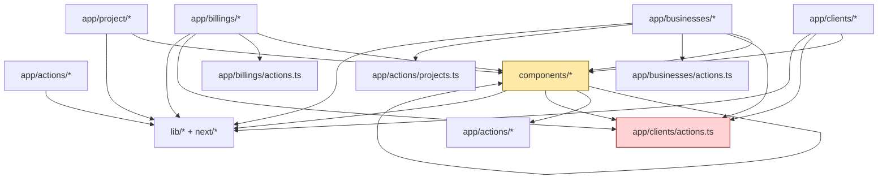

# Phase 7: Cross-Module Coupling Analysis

## 7.1 Import Dependency Mapping

### 7.1.1 Dependency graph + circular dependency scan

### 📊 MODULE DEPENDENCY GRAPH


**Circular Dependencies Found:** **0** (inside scoped modules: `app/actions`, `app/clients`, `app/businesses`, `app/billings`, `app/project`, `components`).

**Details:**
- I scanned all local TypeScript imports in the scoped folders and ran SCC (strongly connected component) detection across those files.
- No file-to-file cycle was detected in this scope.
- There is still **high hub coupling** (especially through `components/I18nProvider.tsx`, `app/clients/actions.ts`, and `components/Sidebar.tsx`), but not a strict circular import.

### Full scoped import inventory (ALL local imports)
#### app/actions/
- `app/actions/auth.ts` -> `lib/supabase/server.ts`
- `app/actions/projects.ts` -> `lib/supabase/server.ts`, `lib/auth.ts`, `lib/constants.ts`
- `app/actions/tasks.ts` -> `lib/supabase/server.ts`, `lib/auth.ts`, `lib/supabase/types.ts`

#### app/clients/
- `app/clients/ClientsPageClient.tsx` -> `lib/supabase/client.ts`, `lib/supabase/types.ts`, `components/Sidebar.tsx`, `components/TopBar.tsx`, `components/I18nProvider.tsx`, `app/actions/auth.ts`, `app/clients/actions.ts`, `app/clients/components/ClientCard.tsx`, `app/clients/components/CreateClientModal.tsx`, `app/clients/components/EditClientModal.tsx`, `app/clients/components/EmptyState.tsx`
- `app/clients/[id]/ClientDetailClient.tsx` -> `lib/supabase/client.ts`, `lib/supabase/types.ts`, `components/DetailLayout.tsx`, `components/I18nProvider.tsx`, `lib/formatPhone.ts`, `app/clients/actions.ts`, `components/ui/dropdown-menu.tsx`, `components/ui/input.tsx`, `components/ui/label.tsx`, `components/ui/button.tsx`, `app/clients/components/EditClientModal.tsx`, `app/clients/components/BusinessCard.tsx`, `app/clients/components/CreateBusinessModal.tsx`, `app/clients/components/EditBusinessModal.tsx`
- `app/clients/[id]/page.tsx` -> `lib/auth.ts`, `app/clients/actions.ts`, `app/clients/[id]/ClientDetailClient.tsx`
- `app/clients/actions.ts` -> `lib/supabase/server.ts`, `lib/auth.ts`, `lib/supabase/types.ts`
- `app/clients/components/BusinessCard.tsx` -> `components/I18nProvider.tsx`, `components/ui/dropdown-menu.tsx`, `app/clients/actions.ts`, `lib/supabase/types.ts`
- `app/clients/components/ClientCard.tsx` -> `components/I18nProvider.tsx`, `components/ui/dropdown-menu.tsx`, `app/clients/actions.ts`, `lib/formatPhone.ts`, `lib/supabase/types.ts`
- `app/clients/components/CreateBusinessModal.tsx` -> `components/I18nProvider.tsx`, `app/clients/actions.ts`, `components/ui/input.tsx`, `components/ui/label.tsx`, `components/ui/textarea.tsx`, `components/ui/select.tsx`, `lib/supabase/types.ts`
- `app/clients/components/CreateClientModal.tsx` -> `components/I18nProvider.tsx`, `app/clients/actions.ts`, `components/ui/input.tsx`, `components/ui/label.tsx`, `components/ui/textarea.tsx`, `components/ui/select.tsx`
- `app/clients/components/EditBusinessModal.tsx` -> `components/I18nProvider.tsx`, `app/clients/actions.ts`, `components/ui/input.tsx`, `components/ui/label.tsx`, `components/ui/textarea.tsx`, `lib/supabase/types.ts`
- `app/clients/components/EditClientModal.tsx` -> `components/I18nProvider.tsx`, `app/clients/actions.ts`, `components/ui/input.tsx`, `components/ui/label.tsx`, `components/ui/textarea.tsx`, `components/ui/select.tsx`, `lib/supabase/types.ts`
- `app/clients/components/EmptyState.tsx` -> `components/I18nProvider.tsx`
- `app/clients/page.tsx` -> `lib/auth.ts`, `app/clients/ClientsPageClient.tsx`

#### app/businesses/
- `app/businesses/BusinessesPageClient.tsx` -> `lib/supabase/client.ts`, `lib/supabase/types.ts`, `components/Sidebar.tsx`, `components/TopBar.tsx`, `components/I18nProvider.tsx`, `app/actions/auth.ts`, `app/clients/actions.ts`, `app/clients/components/BusinessCard.tsx`, `app/clients/components/CreateBusinessModal.tsx`, `app/clients/components/EditBusinessModal.tsx`
- `app/businesses/[id]/BusinessDetailClient.tsx` -> `components/I18nProvider.tsx`, `components/DetailLayout.tsx`, `app/clients/actions.ts`, `app/businesses/actions.ts`, `app/clients/components/EditBusinessModal.tsx`, `components/ui/dropdown-menu.tsx`, `components/ui/input.tsx`, `components/ui/label.tsx`, `components/ui/textarea.tsx`, `components/ui/button.tsx`, `components/ui/select.tsx`, `components/ui/dialog.tsx`, `lib/supabase/types.ts`
- `app/businesses/[id]/page.tsx` -> `lib/auth.ts`, `app/clients/actions.ts`, `app/businesses/[id]/BusinessDetailClient.tsx`
- `app/businesses/actions.ts` -> `lib/auth.ts`, `lib/supabase/server.ts`, `lib/idea-graph/project-links.ts`, `lib/idea-graph/ideas.ts`, `lib/idea-graph/boards.ts`, `app/clients/actions.ts`, `app/actions/projects.ts`, `app/budgets/actions.ts`, `lib/supabase/types.ts`
- `app/businesses/page.tsx` -> `lib/auth.ts`, `app/businesses/BusinessesPageClient.tsx`

#### app/billings/
- `app/billings/BillingsPageClient.tsx` -> `components/I18nProvider.tsx`, `lib/supabase/client.ts`, `lib/supabase/types.ts`, `components/Sidebar.tsx`, `components/TopBar.tsx`, `app/actions/auth.ts`, `app/billings/actions.ts`, `app/clients/actions.ts`
- `app/billings/actions.ts` -> `lib/supabase/server.ts`, `lib/auth.ts`, `lib/supabase/types.ts`
- `app/billings/page.tsx` -> `lib/auth.ts`, `app/billings/BillingsPageClient.tsx`

#### app/project/
- `app/project/[id]/page.tsx` -> `lib/auth.ts`, `components/ProjectKanbanClient.tsx`

#### components/
- `components/AddProjectModal.tsx` -> `components/I18nProvider.tsx`, `app/actions/projects.ts`, `app/clients/actions.ts`, `components/ui/dialog.tsx`, `components/ui/button.tsx`, `components/ui/input.tsx`, `components/ui/label.tsx`, `components/ui/select.tsx`, `lib/constants.ts`, `lib/supabase/types.ts`
- `components/AddTaskModal.tsx` -> `components/I18nProvider.tsx`, `app/actions/tasks.ts`, `lib/supabase/types.ts`, `components/ui/dialog.tsx`, `components/ui/button.tsx`, `components/ui/input.tsx`, `components/ui/label.tsx`, `components/ui/textarea.tsx`, `components/ui/select.tsx`
- `components/AnalyticsDashboard.tsx` -> `components/I18nProvider.tsx`, `lib/supabase/client.ts`, `lib/supabase/types.ts`, `components/Sidebar.tsx`, `components/dashboard/DashboardFocusTasksSection.tsx`
- `components/AppShell.tsx` -> `components/Sidebar.tsx`, `components/GlobalHeader.tsx`, `lib/supabase/types.ts`, `lib/utils.ts`
- `components/AuthCallbackHandler.tsx` -> `lib/supabase/client.ts`
- `components/Column.tsx` -> `components/TaskCard.tsx`, `components/AddTaskModal.tsx`, `components/I18nProvider.tsx`, `lib/supabase/types.ts`, `lib/utils.ts`
- `components/DashboardClient.tsx` -> `lib/supabase/client.ts`, `lib/supabase/types.ts`, `components/KanbanBoard.tsx`, `components/Sidebar.tsx`, `components/TopBar.tsx`, `components/RightPanel.tsx`, `app/actions/auth.ts`
- `components/DetailHeader.tsx` -> `lib/utils.ts`
- `components/DetailLayout.tsx` -> `lib/utils.ts`, `components/GlobalHeader.tsx`
- `components/EditProjectModal.tsx` -> `components/I18nProvider.tsx`, `app/actions/projects.ts`, `app/clients/actions.ts`, `components/ui/dialog.tsx`, `components/ui/button.tsx`, `components/ui/input.tsx`, `components/ui/label.tsx`, `components/ui/textarea.tsx`, `components/ui/select.tsx`, `components/ui/tabs.tsx`, `lib/constants.ts`, `lib/supabase/types.ts`
- `components/EditTaskModal.tsx` -> `app/actions/tasks.ts`, `lib/supabase/types.ts`, `components/ui/dialog.tsx`, `components/ui/button.tsx`, `components/ui/input.tsx`, `components/ui/label.tsx`, `components/ui/textarea.tsx`, `components/ui/select.tsx`
- `components/ForgotPasswordForm.tsx` -> `lib/supabase/client.ts`, `components/ui/button.tsx`, `components/ui/input.tsx`, `components/ui/label.tsx`
- `components/GlobalHeader.tsx` -> `components/I18nProvider.tsx`, `lib/utils.ts`
- `components/I18nProvider.tsx` -> `lib/i18n.ts`, `app/settings/profile/actions.ts`, `app/settings/appearance/actions.ts`
- `components/KanbanBoard.tsx` -> `components/Column.tsx`, `components/TaskCard.tsx`, `components/I18nProvider.tsx`, `lib/supabase/types.ts`, `app/actions/tasks.ts`, `lib/utils.ts`
- `components/LinkedIdeasSection.tsx` -> `lib/idea-graph/project-links.ts`, `lib/idea-graph/ideas.ts`, `components/UnlinkIdeaButton.tsx`
- `components/LoginForm.tsx` -> `app/actions/auth.ts`, `components/ui/button.tsx`, `components/ui/input.tsx`, `components/ui/label.tsx`
- `components/ProjectKanbanClient.tsx` -> `lib/supabase/client.ts`, `lib/supabase/types.ts`, `components/KanbanBoard.tsx`, `components/TopBar.tsx`, `components/ProjectResourcesPanel.tsx`, `app/actions/auth.ts`, `components/SelectionActionBar.tsx`, `components/AddTaskModal.tsx`, `app/actions/tasks.ts`, `lib/utils.ts`, `components/I18nProvider.tsx`
- `components/ProjectResourcesModal.tsx` -> `components/I18nProvider.tsx`, `components/ui/dialog.tsx`, `app/projects/actions.ts`, `lib/utils.ts`
- `components/ProjectResourcesPanel.tsx` -> `components/I18nProvider.tsx`, `app/projects/actions.ts`, `lib/utils.ts`
- `components/RightPanel.tsx` -> `components/I18nProvider.tsx`, `lib/supabase/types.ts`, `components/TaskCard.tsx`
- `components/SelectionActionBar.tsx` -> `components/ui/button.tsx`, `components/ui/dialog.tsx`
- `components/Sidebar.tsx` -> `lib/supabase/types.ts`, `lib/utils.ts`, `components/ui/dropdown-menu.tsx`, `components/EditProjectModal.tsx`, `components/AddProjectModal.tsx`, `app/actions/projects.ts`, `components/I18nProvider.tsx`
- `components/SignupForm.tsx` -> `app/actions/auth.ts`, `components/ui/button.tsx`, `components/ui/input.tsx`, `components/ui/label.tsx`
- `components/TaskCard.tsx` -> `lib/supabase/types.ts`, `components/I18nProvider.tsx`, `components/EditTaskModal.tsx`, `lib/utils.ts`
- `components/ThemeProvider.tsx` -> `app/settings/appearance/actions.ts`, `lib/theme.ts`
- `components/TopBar.tsx` -> `lib/supabase/types.ts`, `components/ui/input.tsx`, `components/ui/button.tsx`, `components/AddProjectModal.tsx`, `components/EditProjectModal.tsx`, `components/ProjectResourcesModal.tsx`, `components/I18nProvider.tsx`, `lib/utils.ts`
- `components/UnlinkIdeaButton.tsx` -> `components/ui/button.tsx`, `app/ideas/[id]/project-link-actions.ts`
- `components/dashboard/CriticalTasksWidget.tsx` -> `lib/supabase/client.ts`, `lib/supabase/types.ts`, `components/EditTaskModal.tsx`
- `components/dashboard/DashboardFocusTasksSection.tsx` -> `components/I18nProvider.tsx`, `lib/supabase/client.ts`, `components/dashboard/TaskListWidget.tsx`, `lib/supabase/types.ts`
- `components/dashboard/TaskListWidget.tsx` -> `components/I18nProvider.tsx`, `lib/supabase/client.ts`, `lib/supabase/types.ts`, `components/EditTaskModal.tsx`
- `components/todo/TodoItemRow.tsx` -> `lib/todo/lists.ts`, `app/todo/actions.ts`, `lib/utils.ts`
- `components/todo/TodoListView.tsx` -> `lib/todo/lists.ts`, `components/todo/TodoItemRow.tsx`, `app/todo/actions.ts`
- `components/todo/TodoListsPanel.tsx` -> `components/ui/button.tsx`, `components/I18nProvider.tsx`, `lib/utils.ts`, `lib/todo/lists.ts`, `app/todo/actions.ts`, `lib/supabase/client.ts`, `lib/supabase/types.ts`
- `components/todo/TodoShell.tsx` -> `components/todo/TodoListsPanel.tsx`, `components/todo/TodoListView.tsx`, `lib/todo/lists.ts`, `app/todo/actions.ts`
- `components/ui/button.tsx` -> `lib/utils.ts`
- `components/ui/dialog.tsx` -> `lib/utils.ts`
- `components/ui/dropdown-menu.tsx` -> `lib/utils.ts`
- `components/ui/input.tsx` -> `lib/utils.ts`
- `components/ui/label.tsx` -> `lib/utils.ts`
- `components/ui/select.tsx` -> `lib/utils.ts`
- `components/ui/tabs.tsx` -> `lib/utils.ts`
- `components/ui/textarea.tsx` -> `lib/utils.ts`


### 7.1.2 Coupling metrics

### 📈 COUPLING METRICS

Coupling score heuristic used:
- **HIGH:** imported by >= 10 scoped files, or imports from >= 5 cross-module files.
- **MEDIUM:** imported by 4–9 scoped files, or imports from 2–4 cross-module files.
- **LOW:** below those thresholds.

| Module/File | Imports FROM other scoped modules | Imported BY other scoped files | Coupling Score |
|---|---:|---:|---|
| `components/I18nProvider.tsx` | 0 | 29 | HIGH (cross-cutting hub) |
| `app/clients/actions.ts` | 0 | 16 | HIGH (data/service hub) |
| `components/Sidebar.tsx` | 1 | 6 | HIGH (UI + behavior hub) |
| `app/businesses/[id]/BusinessDetailClient.tsx` | 11 | 1 | HIGH (orchestration-heavy leaf) |
| `app/businesses/BusinessesPageClient.tsx` | 8 | 1 | HIGH |
| `app/clients/[id]/ClientDetailClient.tsx` | 6 | 1 | HIGH |
| `app/billings/BillingsPageClient.tsx` | 5 | 1 | MEDIUM-HIGH |
| `app/actions/projects.ts` | 0 | 4 | MEDIUM |
| `app/actions/tasks.ts` | 0 | 4 | MEDIUM |
| `app/project/[id]/page.tsx` | 1 | 0 | LOW |

**Highly coupled modules (need refactoring):**
1. `components/I18nProvider.tsx` — imported by 29 scoped files (global concern with high fan-in).
2. `app/clients/actions.ts` — imported by 16 scoped files (domain action hub used outside clients module).
3. `components/Sidebar.tsx` — central shared shell UI, with multiple action dependencies.

**Decoupled modules (good):**
1. `app/project/[id]/page.tsx` — minimal dependencies, clean route wrapper role.
2. `app/actions/auth.ts` — focused auth action surface with moderate/contained usage.

---

## 7.2 Shared State Analysis

### 7.2.1 Global/shared state instances

### 🌍 SHARED STATE #1: I18nContext

**Location:** `components/I18nProvider.tsx`

**Used by:** dozens of components/pages (todo, ideas, billings, businesses, clients, notes, sidebar, topbar, etc.).

**State shared:**
```typescript
{
  locale: 'en' | 'es',
  currency: string,
  t: (key, params?) => string,
  formatCurrency: (amount) => string,
  setPrefs: (partialPrefs) => void
}
```

**Coupling risk:** HIGH

**Problems:**
1. Very high fan-in makes i18n provider a cross-cutting runtime dependency.
2. Locale/currency updates can trigger broad re-render cascades.
3. Presentation + preference persistence + remote bootstrap are bundled together.

**Refactor suggestion:**
- Split transport/bootstrap concern from pure translation access.
- Memoize selector-style hooks (`useLocale`, `useCurrency`) for narrower updates.

### 🌍 SHARED STATE #2: Theme preferences in localStorage + root CSS variables

**Location:** `lib/theme.ts`, consumed by `components/ThemeProvider.tsx` and bootstrapped in `app/layout.tsx`.

**State shared:**
```typescript
localStorage['cq-theme-prefs']
{
  theme_mode: 'light' | 'dark' | 'system',
  primary_color: string,
  secondary_color: string,
  third_color: string
}
```

**Coupling risk:** HIGH

**Problems:**
1. Same persisted state is read in multiple lifecycle paths (layout bootstrap + provider).
2. Theme application mutates global `document.documentElement` CSS variables.
3. Hard to test deterministically in SSR/client mixed code.

**Refactor suggestion:**
- Centralize theme hydration to one authoritative layer and expose read-only derived tokens to UI.

### 🌍 SHARED STATE #3: I18n preferences persistence (`cq-i18n-prefs`)

**Location:** `components/I18nProvider.tsx`

**State shared:**
```typescript
localStorage['cq-i18n-prefs'] = { locale, currency }
```

**Coupling risk:** MEDIUM-HIGH

**Problems:**
1. Persisted client state is merged with profile/preferences server data.
2. Conflict resolution behavior is embedded in provider mount flow.
3. Any consumer implicitly depends on this merge order.

**Refactor suggestion:**
- Extract preference reconciliation strategy into dedicated service function with tests.

### 🌍 SHARED STATE #4: Sidebar collapsed preference (`sidebar-collapsed`)

**Location:** `components/Sidebar.tsx`

**State shared:**
```typescript
localStorage['sidebar-collapsed'] = 'true' | 'false'
```

**Coupling risk:** MEDIUM

**Problems:**
1. UI layout preference is persisted globally and silently reused.
2. Breakpoint behavior + persisted behavior are mixed in one component.

**Refactor suggestion:**
- Move shell UI preferences into a `useShellPrefs` hook/service to isolate persistence concern.

### 🌍 SHARED STATE #5: Auth/session state via Supabase cookies + `getUser()`

**Location:** `lib/supabase/server.ts` + `lib/auth.ts`

**Used by:** many route pages/actions via `requireAuth`/`getUser`.

**State shared:**
```typescript
cookie-backed Supabase auth session
```

**Coupling risk:** HIGH

**Problems:**
1. Authentication state is globally ambient and repeatedly loaded ad-hoc.
2. Domain actions/pages are tightly coupled to runtime cookie availability.
3. Hard to isolate in unit tests without auth-aware harness.

**Refactor suggestion:**
- Add a thin auth boundary interface (adapter) and pass identity context into domain services.

---

## 7.3 God Objects/Files Detection

### 7.3.1 Files with too many responsibilities

### 📦 GOD FILE #1: `app/clients/actions.ts`

**Lines of code:** ~468  
**Number of exports:** 19  
**Imported by:** 16 files

**Responsibilities currently mixed:**
1. Client CRUD
2. Business CRUD
3. Cross-link queries (client ↔ business)
4. Project lookups by client
5. Option/list shaping for UI
6. Data normalization and filtering

**Violation:** Single Responsibility Principle

**Refactor suggestion:**
```
app/clients/actions/
├── clients.ts            # client CRUD
├── businesses.ts         # business CRUD
├── project-links.ts      # project fetches by client/business
├── queries.ts            # read-model DTO builders
└── index.ts
```

**Priority:** P1

### 📦 GOD FILE #2: `components/Sidebar.tsx`

**Lines of code:** ~439  
**Number of exports:** 1 default component (but broad internal behavior)  
**Imported by:** 10 files (repo-wide) / 6 in scoped set

**Responsibilities currently mixed:**
1. Navigation rendering
2. Mobile drawer state and behavior
3. Desktop collapse persistence
4. Favorites load/toggle orchestration
5. Project archive/unarchive/delete action dispatch
6. Routing side effects after deletes
7. Category filtering UI

**Violation:** UI composition + business orchestration mixed in one component

**Refactor suggestion:**
```
components/sidebar/
├── SidebarView.tsx
├── useSidebarPrefs.ts
├── useProjectFavorites.ts
├── useProjectActions.ts
└── index.tsx
```

**Priority:** P1

### 📦 GOD FILE #3: `app/businesses/[id]/BusinessDetailClient.tsx`

**Lines of code:** ~695  
**Number of exports:** 1 default component  
**Imported by:** route page

**Responsibilities currently mixed:**
1. Business profile editing
2. Contact/channel normalization
3. Related clients lookup logic
4. Linked ideas retrieval and mutation
5. Modal/dialog orchestration
6. Form validation/state transitions
7. Dense rendering layout

**Violation:** Multiple domain + UI concerns in one route client

**Refactor suggestion:**
```
app/businesses/[id]/
├── BusinessDetailClient.tsx   # composition only
├── hooks/
│   ├── useBusinessProfile.ts
│   ├── useBusinessIdeas.ts
│   └── useBusinessClients.ts
└── components/
    ├── BusinessProfileForm.tsx
    ├── BusinessLinksPanel.tsx
    └── BusinessActionsMenu.tsx
```

**Priority:** P2

---

## 7.4 Separation of Concerns Violations

### 7.4.1 Business logic living in UI components

### ⚠️ LOGIC IN UI #1: Billing filtering/aggregation in page component

**Location:** `app/billings/BillingsPageClient.tsx`

**Violation snippet (UI owns analytics logic):**
```typescript
const filtered = useMemo(() => {
  const q = searchQuery.trim().toLowerCase()
  if (!q) return billings
  return billings.filter((b) => ...)
}, [billings, searchQuery])

const summary = useMemo(() => {
  return filtered.reduce((acc, b) => {
    const amount = Number(b.amount) || 0
    ...
  }, { total: 0, paid: 0, pending: 0 })
}, [filtered])
```

**Fix:** move to `lib/billings/selectors.ts` (`filterBillings`, `computeBillingSummary`).

### ⚠️ LOGIC IN UI #2: Project lifecycle actions embedded in sidebar

**Location:** `components/Sidebar.tsx`

**Violation snippet:**
```typescript
async function handleArchive(project: Project) {
  if (project.category === 'archived') await unarchiveProject(project.id)
  else await archiveProject(project.id)
}

async function handleDelete(project: Project) {
  if (!confirm(...)) return
  await deleteProject(project.id)
  if (selectedProject === project.id) router.push('/dashboard')
}
```

**Fix:** move orchestration to `useProjectCommands()` hook and keep Sidebar view-focused.

### ⚠️ LOGIC IN UI #3: Client/business relationship orchestration in detail page

**Location:** `app/clients/[id]/ClientDetailClient.tsx`

**Violation:** component handles relation state transitions and multiple domain mutations directly.

**Fix:** extract a `useClientRelationships` hook + `client-service.ts` API adapter.

### ⚠️ LOGIC IN UI #4: Business linking and record reconciliation in detail page

**Location:** `app/businesses/[id]/BusinessDetailClient.tsx`

**Violation:** component coordinates linked ideas, related clients, modal command flows, and update semantics.

**Fix:** split into dedicated hooks/services for links and profile updates.

### ⚠️ LOGIC IN UI #5: Bulk deletion and reorder command logic inside list renderer

**Location:** `app/budgets/[id]/components/ItemsList.tsx`

**Violation snippet:**
```typescript
const handleBulkDelete = async () => {
  const ids = Array.from(selectedIds)
  ...
  await deleteItems(ids, budgetId)
  ...
}

const handleDragEnd = ({ active, over }) => {
  ...
  const nextIds = arrayMove(allItemIds, oldIndex, newIndex)
  onItemsReordered?.(nextIds)
}
```

**Fix:** move command logic to `useBudgetItemsCommands` and keep component as interaction shell.

---

## Execution Checklist

- [x] Generated dependency graph with circular dependency scan
- [x] Calculated coupling metrics
- [x] Found 5+ shared state instances
- [x] Found 3+ god files
- [x] Found 5+ separation of concerns violations
